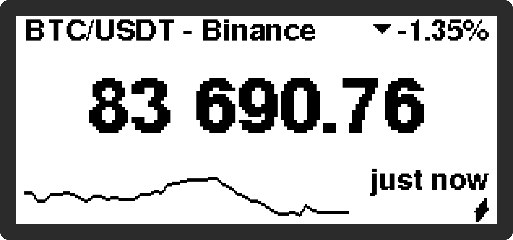
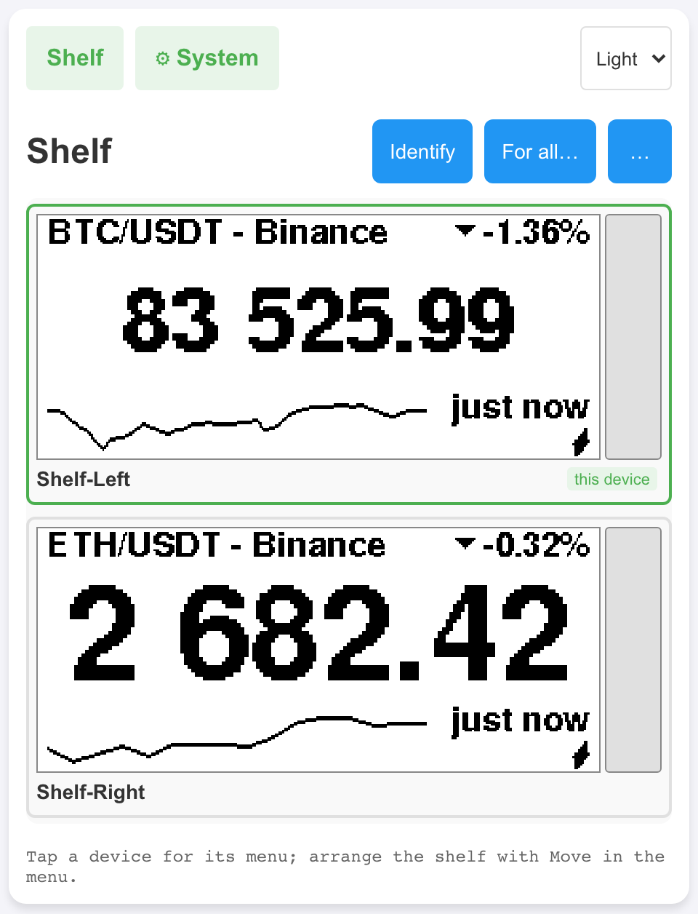
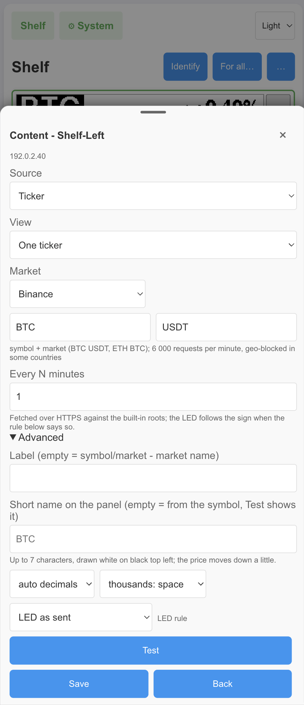
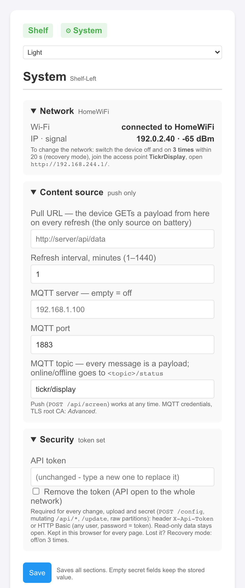
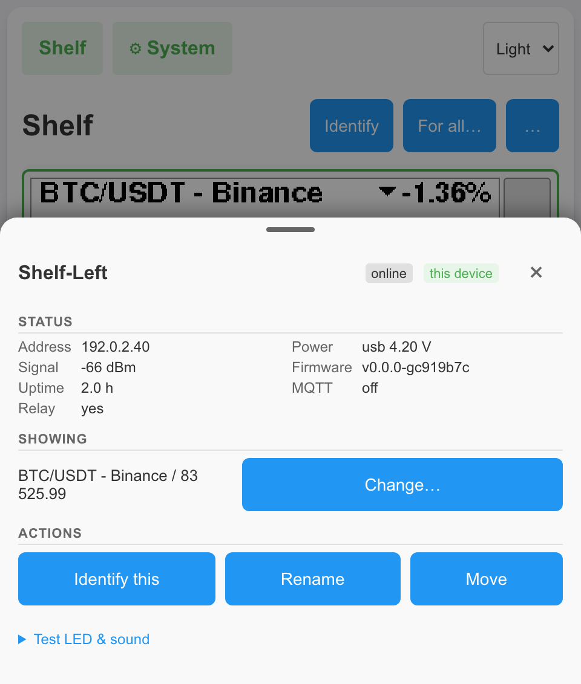

# TickrDisplay

**Cloud-free, open-source firmware for the TickrMeter e-ink ticker.** Crypto quotes fetched by the device itself, any text pushed over HTTP or MQTT, several devices arranged on one virtual shelf – no vendor account, no subscription, nothing leaves your LAN.

[](https://github.com/vskiwi/tickrdisplay/actions/workflows/build.yml)
[](https://github.com/vskiwi/tickrdisplay/releases)
[](LICENSE)


<p align="center">
  
</p>
<p align="center">
  
  
</p>

> **Status: alpha.** Developed and used on two units (board revisions A and B). Expect rough edges and breaking changes before `v1.0`. Flashing third-party firmware **voids the vendor warranty** – read the [Disclaimer](#disclaimer) first.

## Why replace the stock firmware?

The stock TickrMeter is a thin client of the vendor's cloud: the cloud picks the quote, renders the page, and the device shows it. TickrDisplay moves everything onto the device and your LAN.

| | Stock TickrMeter firmware | TickrDisplay |
|---|---|---|
| **Cloud / account** | Vendor account and cloud service required; ticker pages configured on the vendor portal | **None.** Talks only to hosts you configure; no telemetry |
| **Where quotes come from** | The vendor cloud fetches and formats them | **The device fetches them itself** over HTTPS: CoinGecko, Kraken, Binance presets, any JSON API via *Custom JSON*, or your own Node-RED / Home Assistant proxy |
| **Markets** | Stocks, ETFs, indices, forex, crypto (via the cloud) | Crypto presets built in; anything else through *Custom JSON* or a local proxy – **no stock-market presets** |
| **On the screen** | Symbol, price, daily change, time of last trade | Label, price (thousands separator, adaptive decimals), 24 h change with ▲/▼, **sparkline of the last 48 fetches**, relative age (*2 min ago*, *stale 40 min*). No wall clock |
| **Push your own content** | Not possible | **`POST /api/screen`**, **MQTT**, or a **Pull URL** – title + value, LED colour, sound |
| **Light bar** | Red/green by gain or loss | Red/green by sign of change, or any RGB colour per payload (8-bit PWM per channel) |
| **Sound** | Beep on price alerts | Beep presets and **RTTTL ring-tone melodies** per payload |
| **Price alerts / playlist mode** | Yes | **Not implemented** (one symbol per device; alerts are left to your automation) |
| **Several devices** | Managed per account; no arrangement or preview | **LAN discovery**, live e-ink previews, **drag-and-drop shelf**, groups joined by a code on the screen, *For all…* content, relay for sleeping battery devices, group firmware update |
| **Local web UI / API** | Only the Wi-Fi set-up portal, and only in access-point mode | Full web UI on `http://<device-ip>/` + JSON HTTP API with CORS, usable from Home Assistant, curl, scripts |
| **Firmware updates** | Cloud-pull only | Browser upload, `curl`, or fetch-from-URL; dual-slot with **return to stock** |
| **Recovery without cable** | Vendor recovery image over plain HTTP | **Recovery mode via the power switch** (3 power cycles): new token, Wi-Fi change, boot previous firmware, factory reset |
| **Security** | Open set-up portal; firmware unsigned | Optional API token for every mutating endpoint; pairing with code + check word; ticker HTTPS always verified (your uploaded CA, else baked-in roots) |
| **Source code** | Closed | **GPL-3.0-or-later**, PlatformIO, host unit tests, CI |

> **Unverified:** the *stock* column is compiled from the vendor's public pages, reviews and strings in the stock image – not from running the stock firmware side by side with TickrDisplay.

### Feature highlights

* **Cloud-free crypto tickers** – pick CoinGecko / Kraken / Binance (or *Custom JSON*) in the browser, press *Test*, save; the device fetches over HTTPS against roots baked into the firmware.
* **Two power modes, detected automatically** – USB: always on, instant HTTP/MQTT updates. Battery: deep sleep, wake every N minutes, fetch, redraw once, sleep; exponential back-off, low-battery protection.
* **One JSON payload for every path** – `POST /api/screen`, MQTT topic or Pull URL; `title`, `value`, `alert.led`, `alert.sound`, `alert.volume`, plus the ticker fields `change`, `dir`, `age_s`, `time`, `spark[]`.
* **Gentle on the e-ink** – differential (partial) refreshes by default, no inversion flash on every price change; a full refresh only where it is needed.
* **The shelf** – every device as a live card, click for its device sheet, drag to arrange, *Identify* shows a number on each e-ink. Works on a phone.
* **Groups without a server** – Bluetooth-style pairing (6-digit code + check word on the screen), signed device-to-device requests, a USB member holds content and firmware URLs for sleeping members.
* **Cable-free install and updates** – flashes through the stock firmware's own update page; afterwards `/system` or `POST /update`; partition backup and return-to-stock built in.
* **Small and pinned** – fits the stock 4 MB partition layout, gzip-compressed web UI, host unit tests (`pio test -e native`), GitHub Actions + GitLab CI.

## Quick start

You need: the device on **USB power**, a laptop or phone with Wi-Fi, and a way to make your home Wi-Fi temporarily unavailable to the device (the stock firmware opens its portal only when it cannot connect). No cable, no case opening.

1. **Get the firmware** – download `tickrdisplay-<version>.bin` from the [latest release](https://github.com/vskiwi/tickrdisplay/releases) (check the SHA-256 in the release notes), or build it yourself (`cd tickr_display && pio run` → `dist/tickrdisplay-<version>.bin`).
2. **Open the stock update page** – make your Wi-Fi unreachable, power-cycle the device with the switch on the back, join the open access point **`TickrMeter`** and open **`http://192.168.4.1/update`** in a *regular browser tab* (not the captive-portal pop-up – uploads fail there).
3. **Upload** `tickrdisplay-<version>.bin` and press *Update* (1–3 min, no progress bar). The device reboots into TickrDisplay; the stock firmware stays in the other slot.
4. **Restore your Wi-Fi.** The device normally rejoins with the saved credentials. If the e-ink shows *Wi-Fi setup*, join the open access point **`TickrDisplay`** and open `http://192.168.244.1` (most phones open it by themselves), pick your network, *Connect*.
5. **Open `http://<device-ip>/`** – accept *Protect this device* (generates an API token, shown once), click the card → *Change…* → *Ticker* → CoinGecko / Kraken / Binance → symbol → *Test* → *Save*.
6. **Back up the stock firmware** while it is still in the other slot: `/system` → *Firmware* shows the *Running slot*; download the *other* one from the address bar as described in [`docs/FLASHING.md`](docs/FLASHING.md#3-back-up-the-stock-firmware) (the browser asks for the token). The second TickrDisplay update overwrites that slot.

Or push something right away:

```bash
curl -X POST http://<device-ip>/api/screen -u ":<api-token>" \
     -H 'Content-Type: application/json' \
     -d '{"title":"Bitcoin","value":"$95,240","change":"+1.2%","alert":{"led":"00FF00","sound":"beep"}}'
# -> 202 {"status":"queued","queue":1}
```

Full procedure, UART flashing, partition layout, risks and **going back to stock**: **[`docs/FLASHING.md`](docs/FLASHING.md)**.

## Configuration

Settings live in `/config.json` on the device and are edited on **`http://<device-ip>/system`** (Network, Content source, Security, Power, Firmware, Advanced, About – one form, one *Save*); what a device shows is chosen from its card on the shelf (*Change…*). Every form is validated as a whole – an invalid field rejects the save with `400`.

<p align="center">
  
  
</p>

* **Content source** – *Text* (push), *Ticker* (the device fetches), *Custom JSON URL* (Pull URL, HTTP or HTTPS), *MQTT* (broker `<BROKER_HOST>`, port, topic, user/password; retained `<topic>/status` online/offline), *Push only*.
* **Refresh interval** – 1–1440 minutes; the deep-sleep period on battery, the pull/ticker period on USB.
* **LED rule** – `off` (the payload decides) or `sign` (red when down, green when up).
* **Security** – API token (HTTP Basic `-u :<token>` or `X-Api-Token`); required for everything that changes state, uploads or reveals a secret. Read-only data and the pages stay open. Secrets are never echoed back.
* **Power** – power-source override (`auto` / `usb` / `battery`), cell-divider calibration, live voltages.
* **Advanced** – TLS root CA for an HTTPS Pull URL, MQTT credentials, OTA password (developer build).

How the pages behave: **[`docs/WEB_UI.md`](docs/WEB_UI.md)**. Every field, the payload format and the complete HTTP/MQTT API: **[`docs/API.md`](docs/API.md)**.

### Home Assistant in one automation

```yaml
automation:
  - alias: TickrDisplay – outside temperature
    trigger: { platform: state, entity_id: sensor.outside_temperature }
    action:
      - service: mqtt.publish
        data:
          topic: tickr/display
          payload: '{"title":"Outside","value":"{{ states(''sensor.outside_temperature'') }} °C"}'
```

The e-ink frame is also available as `http://<device-ip>/api/screen.bmp` for a picture card.

## Tickers and data sources

The *Ticker* source runs entirely on the device: it fetches one symbol from **CoinGecko**, **Kraken** or **Binance** every refresh interval over HTTPS, extracts price and 24 h change with a mini-JSONPath, formats the price and keeps a 48-point sparkline history in RTC memory across deep sleep. *Custom JSON* takes any URL (`{s}`/`{m}` expanded) and your own price/change/spark paths – the response must be JSON ≤ 4 KB. *Test* runs one fetch on the device before you save. Rate limits and geo-blocking (Binance answers `http 451` from some regions) are the exchanges' – the editor's hints name them.

**TLS:** the presets and a *Custom JSON* ticker URL are **always verified** – against your uploaded root CA when present, else against the roots baked into the firmware (DigiCert Global Root G2, GTS Root R4, GlobalSign Root CA, ISRG Root X1); a chain that does not verify is a failed fetch, never an unverified connection. Only the legacy *Custom JSON URL* Pull source is fetched unverified when no CA is uploaded – the UI flags it as INSECURE.

Prefer a proxy? Node-RED and Home Assistant flows that feed the Pull URL / MQTT with a ready payload (including stocks from other APIs) are in the appendices of **[`docs/TICKERS.md`](docs/TICKERS.md)**.

## Several devices

Open `http://<any device>/` – the page is served by the device and talks to every other TickrDisplay on the LAN from your browser; no server, no internet. Devices find each other with UDP beacons (port 47000), show their real e-ink frame on the shelf and are arranged by drag-and-drop (the layout is stored on the devices). **Groups** are joined like Bluetooth pairing: a 6-digit code and a check word on the target's screen, an X25519 key exchange in between; pairing needs USB power and an API token. Inside a group: *For all…* sends one content everywhere, a USB member acts as **relay** and parks content or a firmware URL for sleeping battery members until their next wake-up, and *Updates* flashes every online member in turn.

How it works, the trust model and the pairing protocol: **[`docs/MULTI_DEVICE.md`](docs/MULTI_DEVICE.md)**.

## Hardware

TickrMeter = ESP32-WROOM-32E module (8 MB flash on both known units, the stock bootloader uses 4 MB), 2.9" 296×128 SSD1680 e-ink, discrete RGB LED, DAC speaker, Li-Po with a charger IC and a power slide switch – **no buttons**, USB-C is power only. Two board revisions differ in flash vendor and battery-sensing wiring; the firmware picks a profile at boot and measures the cell on both. Stacking pads pass the lower unit's USB power upwards (not its battery) – keep the bottom unit of a stack off bare metal. Two 6-pin UART headers are inside the case for a full backup or an emergency reflash.

Pin-out, measured voltages, the stock partition table and what is known about the stock firmware: **[`docs/HARDWARE.md`](docs/HARDWARE.md)**.

## Security and recovery

Built for a **trusted home LAN**: plain HTTP, one shared API token, MQTT without TLS. Set the token (the shelf offers one on first open) – until then anyone on the LAN can reflash the device. Ticker fetches are always TLS-verified (uploaded CA or baked-in roots); only the legacy Pull URL may go unverified, and the UI says so. Pairing codes are bound to a key exchange; screen read-back is withheld while a code is on the e-ink. Wi-Fi credentials sit in unencrypted NVS, as on the stock firmware.

### Lost your token or Wi-Fi? Recovery mode

Switch the device off and on **three times**, each start within **20 s** of the previous one, on USB power: the open access point `TickrDisplay` (`192.168.244.1`) appears next to the normal link and, only for its clients, offers a new token, Wi-Fi change, *Boot previous firmware* and factory reset. Nothing on the LAN can reach these actions, token or not. Software restarts, deep-sleep wake-ups and crashes never count towards the three. Whoever holds the power switch is trusted as the person in charge of the device – keep it where only you can reach it.

Threat model, hardening tips and how to report a vulnerability: **[`SECURITY.md`](SECURITY.md)**. Step by step, with screen texts: **[`docs/WEB_UI.md`](docs/WEB_UI.md#recovery-mode)**.

## Updating and going back to stock

* **Update in the browser:** `http://<device-ip>/system#firmware` – note the *Version*, *Running slot* and *MD5* shown there, choose the new `tickrdisplay-<version>.bin` → *Upload & flash* → confirm; the page shows the progress and reloads after the reboot with the new version and the other slot running.
* **Two slots:** the image goes to the inactive slot, the firmware you were running stays in the other one; an image that crashes before it confirms itself is rolled back by the bootloader. The **second** update overwrites what the first left there – back up the stock firmware first (quick start, step 6). Keep the downloaded release files: they are your way back when the other slot has been overwritten.
* **Back to the previous firmware or to stock:** `/system` → *Firmware* → *Recovery* → *Boot other partition* (nothing is flashed; the button names the slot). Otherwise upload the saved previous image or the vendor's recovery image on the same page. Without token or network: recovery mode. Last resort: UART.
* **Terminals and scripts** (macOS/Linux `bash`, Windows PowerShell, plain `curl`, fetch from a URL) are optional and collected in [`docs/FLASHING.md` → *Command-line tools*](docs/FLASHING.md#7-command-line-tools-optional).

Step by step, how to tell the old image from the new one, slots, backups, UART and risks: **[`docs/FLASHING.md`](docs/FLASHING.md)**.

## Troubleshooting

| Symptom | What to check |
|---|---|
| Stock `/update` upload does nothing | Use a real browser tab, not the captive-portal pop-up; the stock portal times out after a few minutes – power-cycle and retry |
| E-ink says *Wi-Fi setup* after flashing | Join `TickrDisplay`, open `http://192.168.244.1`, pick your network. The portal closes 180 s after the last client leaves |
| Shelf is read-only / `401 – token?` | Enter the API token once in the bar at the top; it is kept in this browser. Lost it → [recovery mode](#lost-your-token-or-wi-fi-recovery-mode) |
| Device shows the battery glyph although it is stacked | Stacking pads not making contact – the unit runs on its cell and will deep-sleep. `GET /api/status` shows `power` |
| Ticker shows *stale N min* / `last_error` says `pull: http 451` | Exchange unreachable or geo-blocked; try another preset or a local proxy |
| `power: unknown` | Unrecognised board – set the power source manually on `/system` → *Power* and open an issue with the output of `/api/power/raw` |
| `POST /update` answers `401` only after the whole upload | Expected: the token is checked when the request completes; nothing is written to flash |
| Content gone after a reboot | By design: only the Ticker, Pull URL and MQTT sources survive a restart; pushed payloads do not – the *Ready* card waits for the next one |

`GET /api/status` (`last_error`, `power`, `rssi`), `GET /api/screen/state` and `GET /api/system/info` (firmware version, partitions) are open without a token and are the first things to read.

## Building

PlatformIO project in `tickr_display/`; toolchain and libraries are pinned.

```bash
cd tickr_display
pio run                  # release image `tickr` (4 MB table, OTA-safe) -> dist/tickrdisplay-<version>.bin
pio run -e tickr_dev     # + ArduinoOTA/mDNS, /dev diagnostics page, verbose serial log (developers only)
pio test -e native       # host unit tests
```

Environments, build flags, size gate, web-UI build step, tests and CI: **[`docs/DEVELOPMENT.md`](docs/DEVELOPMENT.md)**. Cutting a release: **[`docs/RELEASING.md`](docs/RELEASING.md)**. What has landed: **[`CHANGELOG.md`](CHANGELOG.md)**.

**E-ink refresh policy:** a new frame is drawn as a *differential* refresh (only the pixels that changed, no inversion flash); a full refresh cleans the panel every 8th partial or after 60 min on USB, every 6th wake on battery, and for condition cards, layout changes and boot frames. Content refreshes are at least 30 s apart. Details: [`docs/DEVICE_UI.md`](docs/DEVICE_UI.md).

## Known limitations / not yet verified

Everything below exists in the firmware and is covered by host tests where a pure module is involved, but has **not been exercised on real hardware** – reports are welcome. The per-topic notes live in the linked documents.

* **Battery life and deep sleep** – the full deep-sleep cycle on the cell with the current power detector, deep-sleep current and battery life are not measured; the ticker on a battery device (one fetch per wake, the sparkline history surviving deep sleep) is host-tested only ([`docs/HARDWARE.md`](docs/HARDWARE.md), [`docs/TICKERS.md`](docs/TICKERS.md)).
* **Runtime USB → battery switch** – cable pulled from an awake unit: the *On battery* card, the 2-min grace and the restart into the battery flow; likewise the partial-refresh battery wake ([`docs/DEVICE_UI.md`](docs/DEVICE_UI.md)).
* **Low-battery screens** – the BATTERY LOW badge and the BATTERY EMPTY card have never been seen on the e-ink ([`docs/DEVICE_UI.md`](docs/DEVICE_UI.md)).
* **Offline card and link supervisor** – the *No Wi-Fi* card after 10 min without the router, the restore after the link holds again, the firmware's own reconnect attempts and the restart after 30 min offline have not been run as a staged router outage on the bench ([`docs/DEVICE_UI.md`](docs/DEVICE_UI.md)).
* **Voltage readings** – the ADC divider ratios on GPIO 32/33 are fitted, not multimeter-checked, and may be off by up to ≈ 10 % (`adc_cell_num/den` is a setting for that reason); a rev B unit on the stacking pads with a full cell has not been tried ([`docs/HARDWARE.md`](docs/HARDWARE.md)).
* **Failing ticker sources** – the back-off sequence and the *stale N min* line on a dead or rate-limited source, and the Binance `http 451` geo-block from a blocked region ([`docs/TICKERS.md`](docs/TICKERS.md)).
* **Sleeping group members** – the sleeper flow end to end (wake-up beacon, relay lookup, signed fetch, parked payload, frame upload, *asleep* / *pending* badges) and the pairing refusal on a real battery-powered device ([`docs/MULTI_DEVICE.md`](docs/MULTI_DEVICE.md)).
* **Group firmware update** – *Update all members* from the *Updates* card and a parked firmware URL being flashed on a sleeper's wake-up ([`docs/MULTI_DEVICE.md`](docs/MULTI_DEVICE.md), [`docs/FLASHING.md`](docs/FLASHING.md)).
* **Group secret rotation and re-pairing** – *Rotate secret* across two devices, moving a member to another group, and the *Paired: …* / *Pairing failed* outcome frames ([`docs/MULTI_DEVICE.md`](docs/MULTI_DEVICE.md)).
* **Fleets larger than two** – beacon period adaptation, peer-table eviction and the preview scheduler with tens of devices ([`docs/MULTI_DEVICE.md`](docs/MULTI_DEVICE.md)).
* **Real phones** – touch drag, bottom sheets and the captive-portal sheet opening `/wifi` by itself; the recovery actions from a phone joined to the `TickrDisplay` access point; the battery-power recovery frames ([`docs/WEB_UI.md`](docs/WEB_UI.md)).
* **Name badge ghosting** – the black badge with the ticker's short name over a long run of partial refreshes and in a cold room has not been watched for ghosting ([`docs/DEVICE_UI.md`](docs/DEVICE_UI.md)).
* **Device sheet write actions with a token** – *Change…* → Send / Save, *Rename*, *Move*, *Clear pending*, *Test LED & sound*, *Forget* ([`docs/WEB_UI.md`](docs/WEB_UI.md)); cosmetic judgements of the LED breathe / amber tint and the optional double full refresh after a long-lived card ([`docs/DEVICE_UI.md`](docs/DEVICE_UI.md)).
* **Other hardware** – board revisions other than A and B are unknown; open an issue with `esptool.py flash_id` and `/api/power/raw` if yours differs.
* **Windows upload script** – `scripts/flash_ota.ps1` has not been run on a Windows machine; the browser upload is the supported path ([`docs/FLASHING.md`](docs/FLASHING.md)).

Scenarios that need a person at the device are collected in [`docs/MANUAL_TESTS.md`](docs/MANUAL_TESTS.md).

## Documentation

| File | What it covers |
|---|---|
| [`docs/API.md`](docs/API.md) | The JSON payload, every HTTP route with its auth, screen state fields, MQTT, the UDP beacon |
| [`docs/WEB_UI.md`](docs/WEB_UI.md) | The shelf, device sheet, Content editor, token handling, card states, phone layout, recovery mode |
| [`docs/TICKERS.md`](docs/TICKERS.md) | Ticker presets, Custom JSON paths, sparkline history, fetch schedule and errors, TLS, Node-RED / Home Assistant proxies |
| [`docs/MULTI_DEVICE.md`](docs/MULTI_DEVICE.md) | Discovery, the shelf layout, groups and the pairing protocol, the relay for sleeping members, limits |
| [`docs/DEVICE_UI.md`](docs/DEVICE_UI.md) | What the e-ink, LED and speaker show: screens, cards, state machine, e-ink refresh rules |
| [`docs/HARDWARE.md`](docs/HARDWARE.md) | Pin-out, power sensing on both board revisions, stacking pads, UART headers, stock firmware and partition table |
| [`docs/FLASHING.md`](docs/FLASHING.md) | First flash through the stock portal or UART, backups, updating, return to stock, risks |
| [`docs/DEVELOPMENT.md`](docs/DEVELOPMENT.md) | Build environments and flags, size gates, web UI build, TLS bundle, unit tests, CI |
| [`docs/RELEASING.md`](docs/RELEASING.md) | The per-release checklist |
| [`docs/MANUAL_TESTS.md`](docs/MANUAL_TESTS.md) | Test scenarios that need a person at the device |
| [`docs/LEGAL.md`](docs/LEGAL.md) | Interoperability research, trademark use, why GPL |
| [`SECURITY.md`](SECURITY.md) | Threat model, authentication, TLS roots, pairing and relay trust, recovery mode, reporting |
| [`CHANGELOG.md`](CHANGELOG.md) | What changed in each release |
| [`CONTRIBUTING.md`](CONTRIBUTING.md) | How to contribute; what never goes into the repository |
| [`THIRD_PARTY_LICENSES.md`](THIRD_PARTY_LICENSES.md) | Linked libraries and their licences |

## Contributing

Bug reports and pull requests are welcome – see [`CONTRIBUTING.md`](CONTRIBUTING.md) and the issue templates. Say what you tested on real hardware and which board revision you have. **Never commit vendor firmware or flash dumps** (they contain your Wi-Fi password). Security issues: [`SECURITY.md`](SECURITY.md).

## License

TickrDisplay is free software under the **GNU General Public License v3.0 or later** – see [`LICENSE`](LICENSE). The firmware links [GxEPD2](https://github.com/ZinggJM/GxEPD2) (GPL-3.0), so compiled images can only be distributed under GPL-compatible terms. Third-party components: [`THIRD_PARTY_LICENSES.md`](THIRD_PARTY_LICENSES.md); legal background: [`docs/LEGAL.md`](docs/LEGAL.md).

## Credits

[GxEPD2](https://github.com/ZinggJM/GxEPD2) by Jean-Marc Zingg · [Adafruit GFX](https://github.com/adafruit/Adafruit-GFX-Library) & BusIO · [ArduinoJson](https://arduinojson.org) by Benoît Blanchon · [PubSubClient](https://github.com/knolleary/pubsubclient) by Nick O'Leary · [ESPAsyncWebServer](https://github.com/ESP32Async/ESPAsyncWebServer) / [AsyncTCP](https://github.com/ESP32Async/AsyncTCP) (ESP32Async) · Espressif for arduino-esp32 and ESP-IDF.

## Disclaimer

* TickrDisplay is an independent project, **not affiliated with, endorsed by or supported by** the makers of TickrMeter. "TickrMeter" is a trademark of its holder and is used only to identify the hardware this firmware runs on. No vendor binaries are distributed here.
* Installing third-party firmware **voids the vendor's warranty** and ends vendor support for your unit. A failed or interrupted flash can leave the device unbootable until recovered over the internal UART header (the case must be opened).
* With TickrDisplay installed the device **no longer connects to the vendor's cloud**; pages configured on the vendor portal will not show. If you pay for a vendor subscription, cancel it yourself. Returning to stock is described in [`docs/FLASHING.md`](docs/FLASHING.md).
* The software is provided **"AS IS", without warranty of any kind** (GPL-3.0 §15–16). You use it at your own risk.
