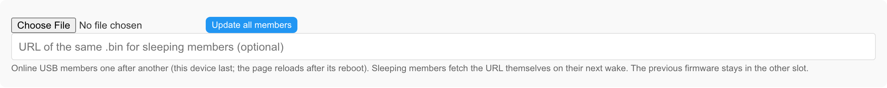

# Web UI

TickrDisplay's web UI is served by the device itself – there is no app, cloud
or companion server. Open the address of any device in a browser and you get
the **Shelf**, a page that talks to *every* TickrDisplay on your LAN directly
from the browser (each device answers with permissive CORS headers, see
[`API.md`](API.md) → *Authentication*). The pages are plain HTML and vanilla
JavaScript compiled into the firmware image (`tickr_display/www/src/`).

This document describes what the UI looks like and how it behaves. The
routes it calls are in [`API.md`](API.md); the screens on the e-ink are in
[`DEVICE_UI.md`](DEVICE_UI.md); pairing and groups in
[`MULTI_DEVICE.md`](MULTI_DEVICE.md); ticker sources in
[`TICKERS.md`](TICKERS.md).

## Pages and navigation

The navigation bar has three items: **Shelf · ⚙ System · theme** (auto /
light / dark).

| URL | Page | What is on it |
|---|---|---|
| `/` | **Shelf** | One card per device in the group, arranged as the devices stand (a 16×16 grid; one device = one large card). Toolbar: *Identify*, *For all…*, *…* (a drawer with the API token field, zoom, *add by IP*, **Nearby** devices, **Group** functions and the **Updates** card). While the host device has no API token, the *Protect this device* card sits above the shelf |
| `/system` | **System** | One form in sections: **Network**, **Content source**, **Security**, **Power**, **Firmware** (with a *Recovery* disclosure), **Advanced**, **About**; one sticky *Save* for the whole form. Also served in set-up mode |
| `/wifi` | **Wi-Fi setup** | Network list, SSID / password, connect status. Carries the **Recovery** section, visible only to clients of the device's own access point while recovery mode is on |
| `/dev` | **Diagnostics & tests** | LED / sound / screen tests, partitions, raw downloads, JSON viewers. Present in `tickr_dev` builds only; linked from *System → Advanced* when available, otherwise `404` |

Legacy URLs redirect: `/panel` → `/`, `/group` → `/#group`, `/config` →
`/system`, `GET /update` → `/system#firmware`.

  

Everything about one device goes through its card: a click (tap, or Enter /
Space on the focused card) anywhere on it opens the **device sheet** – the
device's page as a panel docked to the right edge, with *Status*, *Showing*
(+ *Change…* = the **Content editor** as the second step, *Back* returns),
*Actions* and *Device*. The shelf underneath stays clickable and draggable;
a click on another card replaces the panel, × / Esc / a click outside close
it. Everything about the fleet is on the toolbar and in the drawer.

## User flows

### First open and *Protect this device*

1. After the set-up portal (see [`FLASHING.md`](FLASHING.md)) read the
   address off the e-ink and open `http://<device-ip>/`.
2. The shelf shows one card and, because the API is still open to the whole
   network, the card **This device is open … no API token is set** with
   *Protect it* / *Not now*.
3. *Protect it* generates a random token in the browser and shows it **once**
   with *Copy*; *Set token* writes it to the device, keeps it in this browser
   and offers to set the same token on any other open device on the shelf.
4. *Not now* hides the card; the choice is remembered in this browser.

### Change what a device shows

1. Click the card → device sheet → *Change…*.
2. Choose the **Source**: *Text*, *Ticker*, *Custom JSON URL*, *MQTT* or
   *Push only*. The selector opens on the source the device uses now.
3. *Text*: title and value, optional *Reactions* (LED colour, sound preset,
   volume, LED rule) → *Send*. *Ticker*: *View* (one ticker, or the 2×2
   grid with up to four rows – preset, symbol, market, short name, ▲ ▼ ✕,
   *Test* per row, *+ Add ticker*; the radio button picks the row whose
   *Advanced* settings are shown), market preset (CoinGecko, Kraken,
   Binance, Custom JSON), symbol / market, interval (a 15-minute floor on
   battery with a grid), optional *Test* (one fetch on the device, nothing
   saved), *Advanced* (label, short name for the panel badge, decimals,
   separator, LED rule) → *Save* ([`TICKERS.md`](TICKERS.md) → *Setting it
   up in the web UI*). *Custom JSON URL*: URL + interval → *Save*.
   *MQTT* shows broker and topic with a link to that device's `/system`;
   *Push only* shows a ready `curl` line.
4. The card's next frame poll shows the result.

  

A sleeping or offline card says *plug it in (USB) to change what it shows*
and disables *Send* / *Save*.

### Content for all devices

1. Toolbar → *For all…*.
2. Tick the devices (all members by default, or pick a saved group; offline
   devices are disabled). *Save selection as group* stores the set in the
   shelf layout.
3. Sources here: *Text*, *Ticker*, *Custom JSON URL*. *Send to selected*:
   text goes to online devices at once and is **parked on the relay** (a
   USB-powered member) for sleeping ones; a ticker or URL source is written
   to online devices only – sleepers are reported *asleep – plug it in to
   change its source*.
4. One result line per device.

### Arrange the shelf

* **Drag** a card onto another card or an empty cell (mouse, touch or pen);
  a short press without movement is a click.
* **Move** (device sheet): the card is marked, tap the destination; Esc or a
  tap on the card itself cancels. Arrow keys on a focused card move it too.
* Positions are stored on the devices themselves (the layout document goes
  to every USB member); the status line under the shelf reports the result.

### Identify

1. Toolbar → *Identify*: every reachable device shows its shelf number
   (row by row) on the e-ink for 30 s; the cards overlay the same numbers.
   Asleep and offline devices are skipped.
2. Rearrange until the numbers read 1, 2, 3… in the order the devices stand.
3. *Stop identify* or the timeout clears both sides. *Identify this* in a
   device sheet numbers one device only; after a successful pairing the
   wizard offers *Identify now*.

**Rename**: device sheet → *Rename* → new name (≤ 31 ASCII characters);
written to the device and to the shelf layout.

### Pair a device / join a group

1. Flash and set up the new device. Within about a minute it appears under
   **Nearby – not in this group** in the drawer.
2. *Pair* on its row pre-fills the wizard (target = that device, credentials
   from this member). A target without an API token is offered this
   browser's token first (confirm).
3. *Start pairing*: the target shows a 6-digit code and a 4-letter check
   word on its screen for 90 s.
4. Tick *The check word … match*, type the code, *Confirm*. Three wrong
   codes close the session.
5. The new member reaches the shelf with its next beacon.

Pairing works on USB power only; *Pair* is disabled for a device on battery.
*Leave group* and *Rotate secret* are in the same **Group** card. Protocol:
[`MULTI_DEVICE.md`](MULTI_DEVICE.md).

### Update firmware

* **One device**: ⚙ → *Firmware* – the section shows *Version · built*,
  *Running slot*, *Next slot* (where the upload goes) and *Image size · MD5*
  → choose the `.bin` → *Upload & flash* → confirm. The page shows
  *Uploading… N %*, then *Update successful (N bytes to appX). Rebooting…*
  and reloads after the reboot with the new version. The image goes to the
  inactive slot; the previous firmware stays in the other one. For another
  device open its sheet → *Open device page ↗* first.
* **All members**: drawer → **Updates** → choose the `.bin` → *Update all
  members* → confirm. Online USB members are flashed one after another, this
  device last (its reboot ends the page); progress shows as *flashing N %*
  on the card. An optional URL of the same `.bin` is parked on the relay for
  sleeping members, which fetch it on their next wake.

  

### Return to the previous firmware or to stock

⚙ → *Firmware* → *Recovery* → *Boot other partition (appX)* → confirm. Nothing is
flashed; the device restarts from the other slot (the previous TickrDisplay
or the stock firmware). The button names the slot and is disabled when the
other slot holds no bootable image. Details: [`FLASHING.md`](FLASHING.md). Without a
token or network use recovery mode (below).

## API token in the browser

| | |
|---|---|
| **Needed for** | everything that changes state, uploads or reveals a secret: every `POST` / `PUT` / `DELETE`, `GET /api/config`, `/update`, raw partition / flash downloads, `GET /api/group/secret`, `GET /api/wifi/scan`; all group functions additionally require a token to be *configured* on the device. Route-by-route list: [`API.md`](API.md) |
| **Not needed for** | the pages themselves and read-only data without secrets: `/api/status`, `/api/identity`, `/api/screen/*`, `/api/peers`, `GET /api/layout`, `/api/system/info`, `/api/power/raw`, `/api/wifi/status` |
| **Where it is kept** | in this browser (`localStorage`), entered once, sent as `X-Api-Token` by every page. One token for every device on the shelf; the drawer's *API token* field changes it. The browser never stores the group secret |
| **Read-only mode** | when the device has a token and this browser has none, or the host answers `401`: every write control is greyed, the device sheet shows *Read-only – enter the API token in the bar above…*, drag is disabled, and one red-bordered **API token** bar appears at the top (*Use* stores the token and reloads). A `401` from *another* device is a badge on its card, not a prompt |
| **Lost it?** | recovery mode (below) issues a new one without the old token, a cable or any secret |

## Card states and badges

A card is the device: the live e-ink frame on the left, an **LED bar** on
the right that mirrors the device's real LED colour, the name line with
badges below.

| State | LED bar | Frame | Badge |
|---|---|---|---|
| **online** | the device's current LED colour; LED off → neutral | live (polled) | none while content is shown; otherwise the screen state: *set-up*, *waiting*, *boot*, *recovery*, *updating*, *identify*, *pairing…*, *offline*, *battery_empty*, *power_to_battery* |
| **stale** – beacon missed for four periods, or no frame answer for 2 min | amber (only while the LED is off) | live | *stale* |
| **offline** – frame poll failed twice, or dropped from the peer table | grey, dashed border | last frame, dimmed | *offline – seen hh:mm* |
| **asleep** – battery device between wake-ups | blue-grey | last frame, dimmed | *asleep ~hh:mm* (next expected wake); *pending* when the relay holds content or an update for it – the sheet's *Pending* row says which |
| **battery**, awake | as online | live | *battery* |
| **updating** | as online | last frame | *updating* from the device, *flashing N %* while this browser uploads to it |
| **401** | as online | last frame | *401 – token?* |
| **Nearby** (not a member) | not on the shelf | no frame | listed in the drawer with *Pair* / *Forget* |

Further badges: *this device* (the card the page is served from), *cached
hh:mm* (frame restored from this browser's cache), *position not saved* (the
slot clashed with another card and was moved locally). State names and
colours are repeated in the sheet header and in the drawer's legend. Times
are the browser's clock – the device has none.

### Device sheet contents

* **Status** – rows shown only when known: Address, Power (+ cell voltage),
  Signal, Firmware, Uptime, MQTT, Relay, Pending (content / update), Token
  *none* (red), Error.
* **Showing** – the screen state, or *source · title / value* (a grid's
  title is its symbols, comma-separated), + *Change…*.
* **Actions** – *Identify this* / *Stop identify*, *Rename*, *Move*, *Clear
  pending* (when the relay holds something); *Test LED & sound* disclosure
  (colour, brightness, *Off*; volume, *Beep* – a test only, the next payload
  sets them again). Identify and the test are hidden for asleep / offline.
* **Device** – *Open device page ↗* (not on the host) and *Forget* (offline
  or stale cards only, never the host; confirm).

  

## Phone layout

At widths of 480 px and below:

* the shelf is **one column** in shelf order (row by row); *Zoom* is hidden;
* the device sheet and the Content editor open as **bottom sheets** over a
  dimmed backdrop with the page scroll locked; a tap on the backdrop, × or
  *Back* closes them;
* controls are at least 44 px tall;
* a vertical swipe on a card scrolls the page, a sideways drag still swaps
  cards; **Move** is the intended way to arrange the shelf, and the hint
  under the shelf says so;
* on `/system` only the section named in the URL hash is open.

`/wifi` keeps a single narrow column so it renders inside captive-portal
sheets.

> **Unverified:** touch drag, swipe / scroll feel and the bottom sheets have
> not been checked on a real phone (only in a desktop browser at phone
> width); nor has whether the captive-portal sheet of iOS / Android opens
> `/wifi` automatically.

> **Unverified:** the device sheet's write actions with a token (*Change…* →
> Send / Save, Rename, Move, Clear pending, Test LED & sound, Forget) have
> not been exercised on hardware.

## Recovery mode

The device has one physical control – the power switch – and the browser
holds the token. Recovery mode makes a lost token, a new Wi-Fi network, a
bad update or a group the device should leave fixable **at the device,
without a cable and without any secret**, and changes nothing by itself.

| | |
|---|---|
| **Enter** | switch the device off and on **3 times**, each start within **20 s** of the previous one, on **USB power**. Only real power-ups count (power-on, reset pin, brownout); a software restart (update, reboot, slot switch), a deep-sleep wake-up or a crash never counts and clears a half-finished series, so updates and crash loops cannot end in recovery |
| **What the screen shows** | start 1: *TickrDisplay \<version\> / Recovery: switch off/on now*. Start 2: *Restart 2 of 3 / Switch off again within 20 s / to enter recovery mode*. Start 3: *Recovery mode / Join Wi-Fi: TickrDisplay / open http://192.168.244.1* with a status note. On battery there is no splash on a plain start; the third start shows *Recovery: USB only / Connect USB power, then switch off/on 3x again* |
| **While it is on** | the open access point **`TickrDisplay`** (`192.168.244.1`) comes up **next to** the normal Wi-Fi link; MQTT, pull, beacons, shelf and API keep working. Captive redirect applies to clients of the access point only |
| **The recovery page** | join `TickrDisplay`, open `http://192.168.244.1/` → the Wi-Fi page with a **Recovery** section: *New API token* (shown once, *Copy*), *Remove API token*, *Leave group*, *Forget Wi-Fi network* (pick a new one in the list below), *Boot previous firmware* (other slot, when it holds a valid image), *Factory reset* (settings, layout, peers, CA; Wi-Fi credentials only with the checkbox). Each action asks for confirmation |
| **Nothing reachable from the LAN** | a recovery action is accepted only if the request arrived on the access-point interface and the mode is on. From the LAN every recovery `POST` answers `403`, with or without the token, whatever the `Host` or forwarding headers say. `GET /api/recovery/status` is open through the access point and token-protected from the LAN |
| **Exit** | after 10 min without access-point clients, after 30 min at most, or with any reboot. The content frame returns |
| **Set-up portal** | when recovery was triggered but the device has no network to join, the set-up portal holds the access point and shows the same *Recovery* section. Without a recovery series the portal is Wi-Fi only |
| **Address** | `192.168.244.1/24` for every access-point mode of TickrDisplay (the stock firmware's portal uses `192.168.4.1`) |

> **Unverified:** the recovery actions from the access-point side (new /
> removed token, leave group, forget / connect Wi-Fi, boot previous, factory
> reset) have not been exercised from a phone joined to the `TickrDisplay`
> access point, and the battery-power recovery frames have not been seen on
> a device.

Security reasoning: [`../SECURITY.md`](../SECURITY.md). Screen texts:
[`DEVICE_UI.md`](DEVICE_UI.md).
